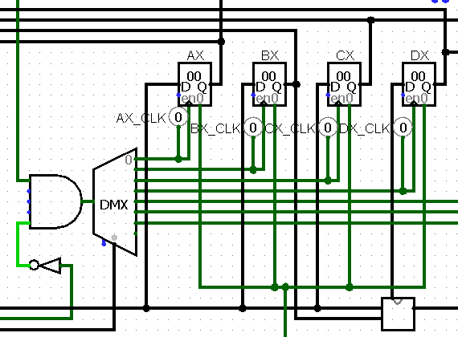

# (hardware) Mechanical Madness

### Proof of Concept

After initially looking at the files given to us, we can see that there is a
circuit file, two assembly files, and an output file.

The circuit file can be opened with an amazing open-source application called
[Logisim](http://www.cburch.com/logisim/). After opening `cpu.circ`, we can see
we have a massive circuit.


We can notice that we have a lot of wires running
into CU and some other interesting things happening with a RAM and with
registers.




This circuit basically executes an assembly program, but not in the format we
were given. The assembly file given is in normal assembly, however it only executes
programs entered into the RAM in it's own bytecode. We have to figure out how to
translate `program.asm` into the byte code required for this CPU to execute the
program. The `example.asm` file is an example of a small assembly program along
with `example.data` being the translated bytecode tailored for this CPU.

To start, we need to figure out how instructions from the RAM are executed.
The `WR` D-Flip-Flop splits 21 bytes into `RA`, `RB`, and `IR`. The **IR** is
the instruction register and determines which instruction should be executed.
**RA** and **RB** are the two operands the instructions might possibly use. For
example, this is what an instruction would look like in binary and in the bytecode:
```
             [INSTR]  [RA]   [RB]
asm      :    movl     ax,    10
binary   :    10000   0000   1010
bytecode :     10      00     0a  
```


Since **IR** is 5 bits, we can expect there to be between `2^4` and `2^5`
instructions. There won't be something like nine instructions because, then **IR**
would only need to be 4 bits to fit all 9 instructions instead of 5 bits. In this,
we have 5 bits.

**Opcode Table:**

| Opcode (hex) | Opcode (binary) | Instruction |
|:------------:|:---------------:|:------------:
| 00           | 00000           | ADD         |
| 01           | 00001           | SUB         |
| 02           | 00010           | MULT        |
| 03           | 00011           | CLR         |
| 04           | 00100           | RESET       |
| 05           | 00101           | JMP         |
| 06           | 00110           | LJMP        |
| 07           | 00111           | JLP         |
| 08           | 01000           | JG          |
| 09           | 01001           | JGE         |
| 0a           | 01010           | JL          |
| 0b           | 01011           | JLE         |
| 0c           | 01100           | JE          |
| 0d           | 01101           | JZ          |
| 0e           | 01110           | JNZ         |
| 0f           | 01111           | MOV         |
| 10           | 10000           | MOVL        |
| 11           | 10001           | CALL        |
| 12           | 10010           | RET         |
| 13           | 10011           | CMP         |
| 14           | 10100           | PUSH        |
| 15           | 10101           | POP         |
| 16           | 10110           | DIV         |
| 17           | 10111           | MMIV        |
| 18           | 11000           | MMOV        |
| 19           | 11001           |             |
| 1a           | 11010           | MSK         |
| 1b           | 11011           | MSKB        |
| 1c           | 11100           |             |
| 1d           | 11101           |             |
| 1e           | 11110           |             |
| 1f           | 11111           |             |


Not all of the opcodes are used, but now we can match the right opcode to the
right instruction. The next step is to identify what the value of the registers
are since both operands are 8 bits each.
```
Ax = 00000000
Bx = 00000001
Cx = 00000010
Dx = 00000011
```

Now, with a custom compiler, we can compile `program.asm` into something that
can be ran with the circuit.

### Vulnerability Explanation

There wasn't much of a vulnerability to exploit here, but just the fact that the
TTY panel in the hardware design is with specific input.

### Solvers/Scripts Used

Assemble the provided `program.asm` with the following script. Then, run the program in
LogiSim at the highest frequency, then the flag will be printed to the virtual TTY.

```python
source = [x.strip().upper().replace(',', '') for x in open("program.asm", "r").readlines()]

registers = {
    'AX': 0,
    'BX': 1,
    'CX': 2,
    'DX': 3
}

opcode_map = {
'ADD':0b00000,
'SUB':0b00001,
'MULT':0b00010,
'CLR':0b00011,
'RST':0b00100,
'JMP':0b00101,
'LJMP':0b00110,
'JLP':0b00111,
'JG':0b01000,
'JGE':0b01001,
'JL':0b01010,
'JLE':0b01011,
'JE':0b01100,
'JZ':0b01101,
'JNZ':0b01110,
'MOV ':0b01111,
'MOVL':0b10000,
'CALL':0b10001,
'RET':0b10010,
'CMP':0b10011,
'PUSH':0b10100,
'POP':0b10101,
'DIV':0b10110,
'MMIV':0b10111,
'MMOV':0b11000,
'MSK':0b11010,
'MSKB':0b11011,
}

labels = {}

output = ""

def get_value(x):
    print(x)
    if x in registers:
        return get_value(registers[x])
    if x == ':SUB4+1':
        return get_value(labels[x[:-2]] + 1)
    if x in labels:
        return get_value(labels[x])

    if type(x) is str:
        if x.startswith('0X'):
            x = int(x, 16)    
        else:
            x = int(x, 10)    


    return hex(x)[2:].rjust(2, '0') + ' '

for i, x in enumerate(source):
    if x[0] == ":":
        labels[x] = (i - len(labels))

for i, x in enumerate(source):
    if x[0] == ":":
        continue
    split = x.split()
    if len(split) == 1:
        cmd = split[0]

        output += get_value(opcode_map[cmd])
        output += get_value(0x00)
        output += get_value(0x00)
    elif len(split) == 2:
        cmd = split[0]
        rega = split[1]

        output += get_value(opcode_map[cmd])
        output += get_value(rega)
        output += get_value(0x00)
    elif len(split) == 3:
        cmd = split[0]
        rega = split[1]
        regb = split[2]
        output += get_value(opcode_map[cmd])
        output += get_value(rega)
        output += get_value(regb)

instrs = output.split(' ')
for i in range(0, len(instrs), 3):
    print(''.join(instrs[i:i+3]), end=' ')
```
